# Manual Técnico - Práctica 1: Monte Alto y la Conectividad
## Redes de Computadoras 2 - Grupo 41
### Universidad San Carlos de Guatemala - Facultad de Ingeniería

---

## Integrantes - Grupo 41
### Harold Alejandro Sánchez Hernández - 202200100
### Engel Emilio Coc Raxjal - 202200314
### Madeline Fabiola Prado Reyes - 202100039


---

## 1. Información General

| Campo | Detalle |
|---|---|
| Curso | Redes de Computadoras 2 |
| Práctica | Práctica 1 - Monte Alto y la Conectividad |
| Grupo | 41 (dígito reducido: 5) |
| Dominio VTP | G41 |
| Herramienta | Cisco Packet Tracer |

---

## 2. Topología de Red

La red está compuesta por dos edificios conectados mediante 4 routers en línea horizontal:
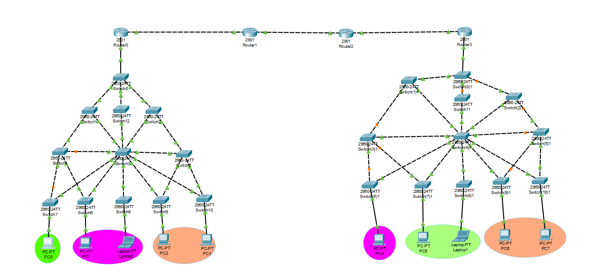


### Dispositivos utilizados
- 4 Routers Cisco 2901
- 24 Switches Cisco 2960-24TT
- 8 PCs y 2 Laptops
- Cables Copper Straight-Through y Copper Cross-over

---

## 3. VLANs Configuradas

### Número de grupo: 41 → dígito reducido = 4+1 = 5

### Edificio Izquierdo

| VLAN | Nombre | Número |
|---|---|---|
| Primaria | Primaria | 15 (10 + 5) |
| Básicos | Basicos | 25 (20 + 5) |
| Bachillerato | Bachillerato | 35 (30 + 5) |

### Edificio Derecho

| VLAN | Nombre | Número |
|---|---|---|
| Primaria | Primaria | 65 (60 + 5) |
| Básicos | Basicos | 75 (70 + 5) |
| Bachillerato | Bachillerato | 85 (80 + 5) |

---

###   VLANs edificio izquierdo

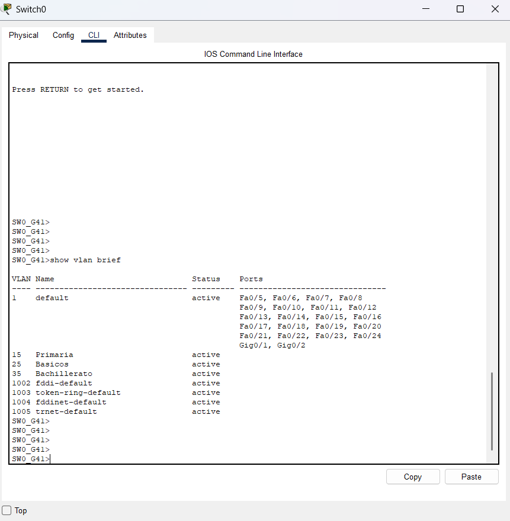

---

###   VLANs edificio derecho

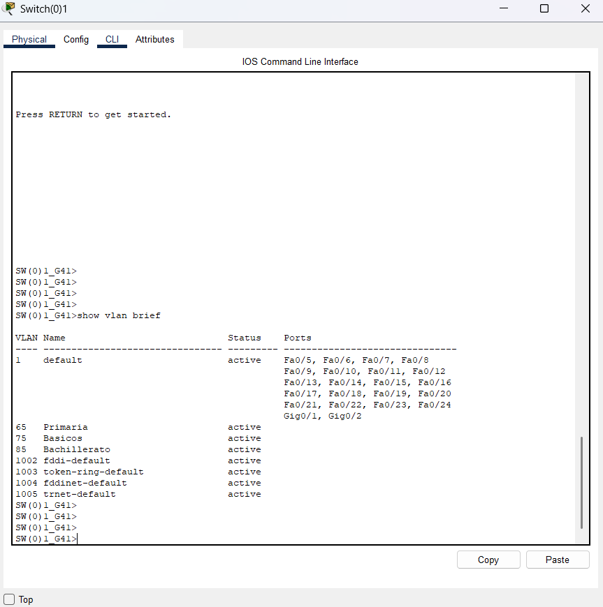

---


## 4. Direccionamiento IP

### Hosts (PCs y Laptops)

| Dispositivo | VLAN | IP | Máscara | Gateway |
|---|---|---|---|---|
| PC0 | Básicos 25 | 192.178.25.2 | 255.255.255.0 | 192.178.25.1 |
| PC1 | Bachillerato 35 | 192.178.35.2 | 255.255.255.0 | 192.178.35.1 |
| Laptop0 | Bachillerato 35 | 192.178.35.3 | 255.255.255.0 | 192.178.35.1 |
| PC2 | Primaria 15 | 192.178.15.2 | 255.255.255.0 | 192.178.15.1 |
| PC3 | Primaria 15 | 192.178.15.3 | 255.255.255.0 | 192.178.15.1 |
| PC4 | Bachillerato 85 | 192.178.85.2 | 255.255.255.0 | 192.178.85.1 |
| PC5 | Básicos 75 | 192.178.75.2 | 255.255.255.0 | 192.178.75.1 |
| Laptop1 | Básicos 75 | 192.178.75.3 | 255.255.255.0 | 192.178.75.1 |
| PC6 | Primaria 65 | 192.178.65.2 | 255.255.255.0 | 192.178.65.1 |
| PC7 | Primaria 65 | 192.178.65.3 | 255.255.255.0 | 192.178.65.1 |

### Interfaces de Routers

| Router | Interfaz | IP | Red |
|---|---|---|---|
| Router0 | Gig0/1.15 | 192.178.15.1 | VLAN 15 Primaria |
| Router0 | Gig0/1.25 | 192.178.25.1 | VLAN 25 Básicos |
| Router0 | Gig0/1.35 | 192.178.35.1 | VLAN 35 Bachillerato |
| Router0 | Gig0/0 | 10.10.8.1 | Enlace EIGRP |
| Router1 | Gig0/0 | 10.10.8.2 | Enlace EIGRP |
| Router1 | Gig0/1 | 10.10.7.1 | Enlace RIP |
| Router2 | Gig0/0 | 10.10.7.2 | Enlace RIP |
| Router2 | Gig0/1 | 10.10.6.1 | Enlace OSPF |
| Router3 | Gig0/0 | 10.10.6.2 | Enlace OSPF |
| Router3 | Gig0/1.65 | 192.178.65.1 | VLAN 65 Primaria |
| Router3 | Gig0/1.75 | 192.178.75.1 | VLAN 75 Básicos |
| Router3 | Gig0/1.85 | 192.178.85.1 | VLAN 85 Bachillerato |

### Redes de Enrutamiento Dinámico

| Protocolo | Red | Cálculo |
|---|---|---|
| EIGRP | 10.10.8.0/24 | X = 3 + 5 = 8 |
| RIP | 10.10.7.0/24 | X = 2 + 5 = 7 |
| OSPF | 10.10.6.0/24 | X = 1 + 5 = 6 |

---

## 5. Configuración VTP

### Dominio: G41

| Switch | Modo VTP | Rol |
|---|---|---|
| SW0_G41 (Switch0) | Server | Crea y distribuye VLANs lado izquierdo |
| SW(0)1_G41 | Server | Crea y distribuye VLANs lado derecho |
| Demás switches izquierdo | Client | Reciben VLANs del servidor |
| Demás switches derecho | Client | Reciben VLANs del servidor |

### Comandos VTP Server
```
enable
configure terminal
vtp mode server
vtp domain G41
vtp password redes2grupo41
end
write memory
```

### Comandos VTP Client
```
enable
configure terminal
vtp mode client
vtp domain G41
end
write memory
```

---

###  VTP Status Switch0

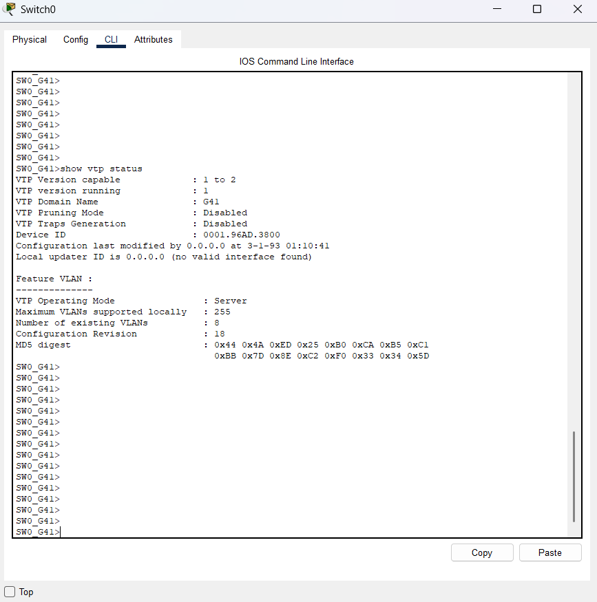

---

###  VTP Status Switch(0)1

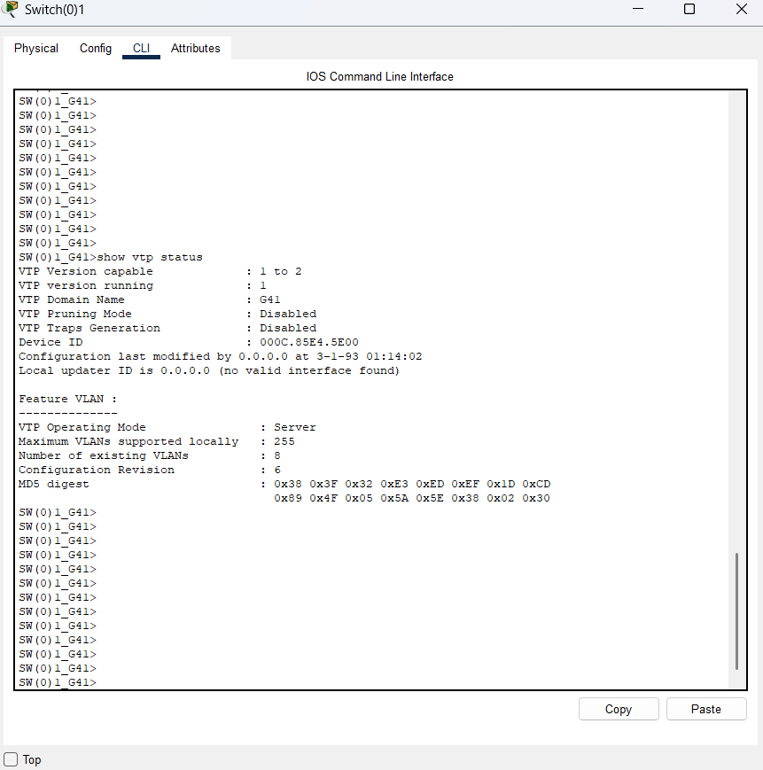

---


## 6. Configuración de Switches

### Formato de hostname
```
SW#A_G#B
Donde: A = número de switch, B = número de grupo (41)
Ejemplo: SW0_G41, SW1_G41, etc.
```

### Contraseña en switches VTP Server
```
redes2grupo41
```

### Comandos de configuración base de switches
```
enable
configure terminal
hostname SW0_G41
enable secret redes2grupo41
end
write memory
```

### Configuración de puertos trunk
```
enable
configure terminal
interface GigabitEthernet0/1
switchport mode trunk
switchport trunk allowed vlan all
no shutdown
exit
end
write memory
```

### Configuración de puertos access (ejemplo VLAN 25)
```
enable
configure terminal
interface FastEthernet0/1
switchport mode access
switchport access vlan 25
no shutdown
exit
end
write memory
```

---

## 7. Configuración de Routers

### Router0 - EIGRP (Edificio Izquierdo)
```
enable
configure terminal
hostname Router0

! Interfaz hacia Switch0 (inter-VLAN routing)
interface GigabitEthernet0/1
no shutdown
exit

! Subinterfaz VLAN 15 - Primaria
interface GigabitEthernet0/1.15
encapsulation dot1Q 15
ip address 192.178.15.1 255.255.255.0
no shutdown
exit

! Subinterfaz VLAN 25 - Basicos
interface GigabitEthernet0/1.25
encapsulation dot1Q 25
ip address 192.178.25.1 255.255.255.0
no shutdown
exit

! Subinterfaz VLAN 35 - Bachillerato
interface GigabitEthernet0/1.35
encapsulation dot1Q 35
ip address 192.178.35.1 255.255.255.0
no shutdown
exit

! Interfaz hacia Router1
interface GigabitEthernet0/0
ip address 10.10.8.1 255.255.255.0
no shutdown
exit

! Configurar EIGRP
router eigrp 1
network 192.178.15.0 0.0.0.255
network 192.178.25.0 0.0.0.255
network 192.178.35.0 0.0.0.255
network 10.10.8.0 0.0.0.255
no auto-summary
exit

! Rutas estáticas hacia edificio derecho
ip route 192.178.65.0 255.255.255.0 10.10.8.2
ip route 192.178.75.0 255.255.255.0 10.10.8.2
ip route 192.178.85.0 255.255.255.0 10.10.8.2
ip route 10.10.7.0 255.255.255.0 10.10.8.2
ip route 10.10.6.0 255.255.255.0 10.10.8.2

end
write memory
```

---

### Interfaces Router0


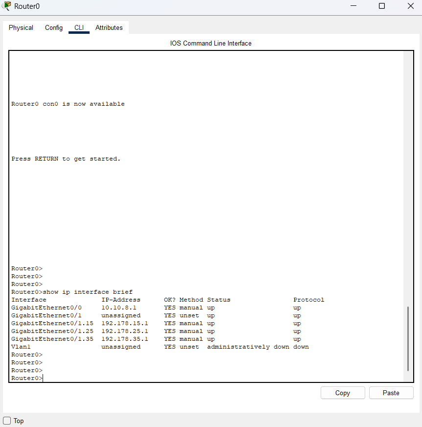

---

###  Rutas Router0


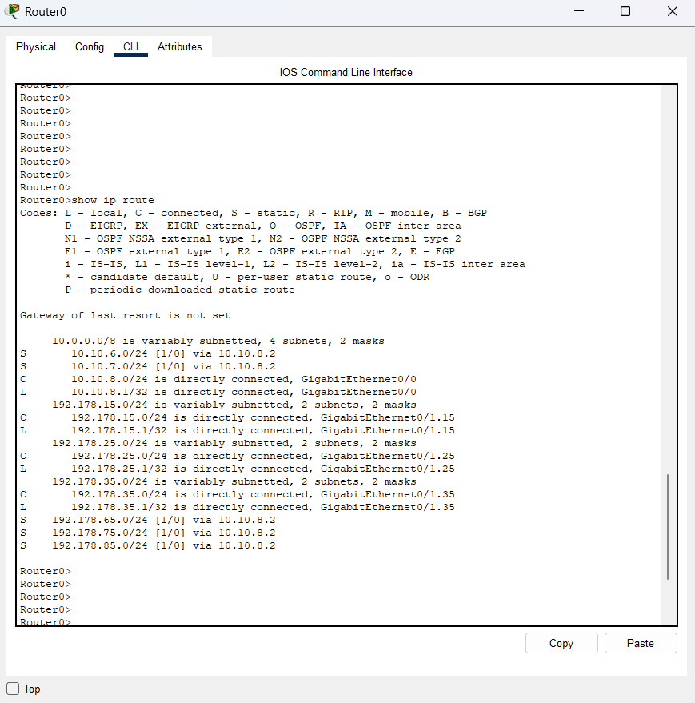

---

### Router1 - RIP (Router central izquierdo)
```
enable
configure terminal
hostname Router1

interface GigabitEthernet0/0
ip address 10.10.8.2 255.255.255.0
no shutdown
exit

interface GigabitEthernet0/1
ip address 10.10.7.1 255.255.255.0
no shutdown
exit

router rip
version 2
network 10.10.8.0
network 10.10.7.0
no auto-summary
exit

! Rutas estáticas
ip route 192.178.15.0 255.255.255.0 10.10.8.1
ip route 192.178.25.0 255.255.255.0 10.10.8.1
ip route 192.178.35.0 255.255.255.0 10.10.8.1
ip route 192.178.65.0 255.255.255.0 10.10.7.2
ip route 192.178.75.0 255.255.255.0 10.10.7.2
ip route 192.178.85.0 255.255.255.0 10.10.7.2

end
write memory
```

### Router2 - RIP (Router central derecho)
```
enable
configure terminal
hostname Router2

interface GigabitEthernet0/0
ip address 10.10.7.2 255.255.255.0
no shutdown
exit

interface GigabitEthernet0/1
ip address 10.10.6.1 255.255.255.0
no shutdown
exit

router rip
version 2
network 10.10.7.0
network 10.10.6.0
no auto-summary
exit

! Rutas estáticas
ip route 192.178.15.0 255.255.255.0 10.10.7.1
ip route 192.178.25.0 255.255.255.0 10.10.7.1
ip route 192.178.35.0 255.255.255.0 10.10.7.1
ip route 192.178.65.0 255.255.255.0 10.10.6.2
ip route 192.178.75.0 255.255.255.0 10.10.6.2
ip route 192.178.85.0 255.255.255.0 10.10.6.2

end
write memory
```

### Router3 - OSPF (Edificio Derecho)
```
enable
configure terminal
hostname Router3

interface GigabitEthernet0/0
ip address 10.10.6.2 255.255.255.0
no shutdown
exit

interface GigabitEthernet0/1
no shutdown
exit

! Subinterfaz VLAN 65 - Primaria
interface GigabitEthernet0/1.65
encapsulation dot1Q 65
ip address 192.178.65.1 255.255.255.0
no shutdown
exit

! Subinterfaz VLAN 75 - Basicos
interface GigabitEthernet0/1.75
encapsulation dot1Q 75
ip address 192.178.75.1 255.255.255.0
no shutdown
exit

! Subinterfaz VLAN 85 - Bachillerato
interface GigabitEthernet0/1.85
encapsulation dot1Q 85
ip address 192.178.85.1 255.255.255.0
no shutdown
exit

router ospf 1
network 192.178.65.0 0.0.0.255 area 0
network 192.178.75.0 0.0.0.255 area 0
network 192.178.85.0 0.0.0.255 area 0
network 10.10.6.0 0.0.0.255 area 0
exit

! Rutas estáticas hacia edificio izquierdo
ip route 192.178.15.0 255.255.255.0 10.10.6.1
ip route 192.178.25.0 255.255.255.0 10.10.6.1
ip route 192.178.35.0 255.255.255.0 10.10.6.1
ip route 10.10.7.0 255.255.255.0 10.10.6.1
ip route 10.10.8.0 255.255.255.0 10.10.6.1

end
write memory
```
---

###  Interfaces Router3

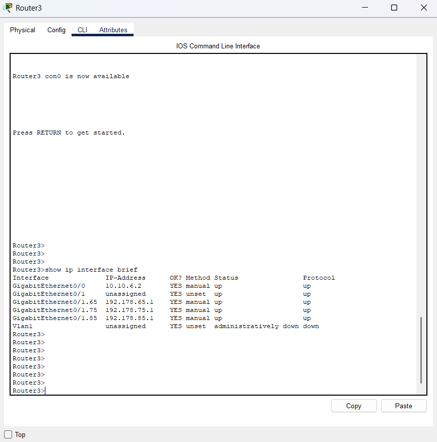

---

---


## 8. Enrutamiento Dinámico

### Descripción de protocolos utilizados

| Router | Protocolo | Red | Justificación |
|---|---|---|---|
| Router0 | EIGRP AS 1 | 10.10.8.0/24 | Protocolo Cisco propietario, alta eficiencia y convergencia rápida para el edificio izquierdo |
| Router1 | RIP v2 | 10.10.7.0/24 y 10.10.8.0/24 | Protocolo estándar de enrutamiento por vector distancia, conecta ambos extremos |
| Router2 | RIP v2 | 10.10.6.0/24 y 10.10.7.0/24 | Protocolo estándar de enrutamiento por vector distancia, conecta ambos extremos |
| Router3 | OSPF Area 0 | 10.10.6.0/24 | Protocolo de estado de enlace, alta eficiencia para el edificio derecho |

### Verificación de rutas
Comando para verificar: `show ip route`

---

## 9. Seguridad de Puertos (Port-Security)

### Configuración para VLAN Básicos

La seguridad de puertos se aplica en los puertos conectados a hosts de la VLAN Básicos (VLAN 25 izquierda y VLAN 75 derecha).

```
enable
configure terminal
interface FastEthernet0/X
switchport mode access
switchport access vlan 25
switchport port-security
switchport port-security maximum 1
switchport port-security mac-address sticky
switchport port-security violation shutdown
no shutdown
exit
end
write memory
```

### Parámetros configurados

| Parámetro | Valor | Descripción |
|---|---|---|
| Maximum MACs | 1 | Solo se permite 1 dirección MAC por puerto |
| MAC Address | sticky | Aprende automáticamente la MAC conectada |
| Violation mode | shutdown | Apaga el puerto si detecta una MAC no autorizada |

---
---

### Port-Security

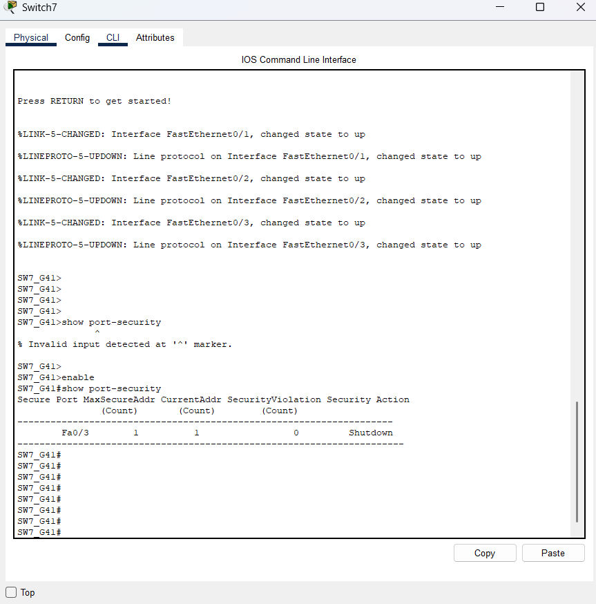

---

## 10. Spanning Tree Protocol

### Configuración por edificio

| Edificio | Protocolo | Comando |
|---|---|---|
| Izquierdo | PVST | `spanning-tree mode pvst` |
| Derecho | Rapid PVST | `spanning-tree mode rapid-pvst` |

### Comandos PVST (Edificio Izquierdo)
```
enable
configure terminal
spanning-tree mode pvst
spanning-tree vlan 15 root primary
spanning-tree vlan 25 root primary
spanning-tree vlan 35 root primary
end
write memory
```

### Comandos Rapid PVST (Edificio Derecho)
```
enable
configure terminal
spanning-tree mode rapid-pvst
spanning-tree vlan 65 root primary
spanning-tree vlan 75 root primary
spanning-tree vlan 85 root primary
end
write memory
```
---

###  STP PVST lado izquierdo

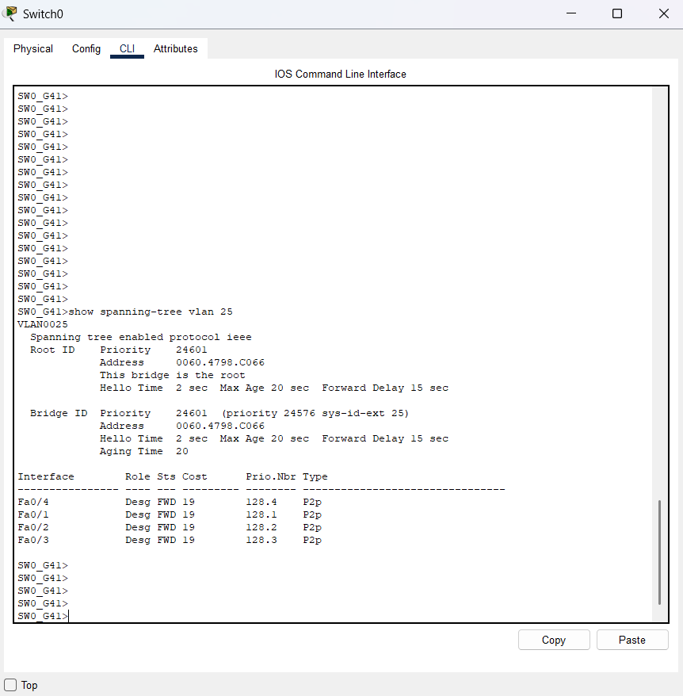

---

###  STP Rapid PVST lado derecho

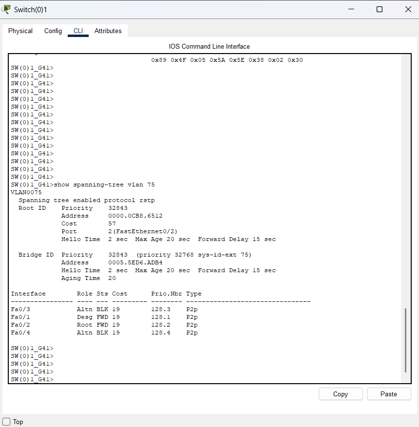

---


### Tabla de Convergencia STP

| Protocolo | VLAN | Tiempo de Convergencia | Observación |
|---|---|---|---|
| PVST | 15, 25, 35 | ~30-50 segundos | Convergencia lenta, usa estados Listen y Learn |
| Rapid PVST | 65, 75, 85 | ~1-5 segundos | Convergencia rápida, mecanismo de negociación |

### Justificación técnica del protocolo elegido

**Protocolo elegido: Rapid PVST**

Se elige Rapid PVST como el protocolo óptimo por las siguientes razones:

1. **Tiempo de convergencia**: Rapid PVST converge en menos de 5 segundos comparado con los 30-50 segundos de PVST tradicional.
2. **Eficiencia**: Utiliza un mecanismo de negociación rápida (proposal/agreement) que elimina los temporizadores fijos de PVST.
3. **Compatibilidad**: Rapid PVST es compatible con PVST, permitiendo coexistencia en redes mixtas.
4. **Aplicación práctica**: En un entorno educativo como el Colegio Monte Alto, donde la disponibilidad de la red es crítica para las clases, una convergencia rápida minimiza el tiempo de inactividad ante fallos de enlaces.

---

## 11. Pruebas de Comunicación

Todas las pruebas se realizaron desde **PC0 (192.178.25.2)**.

### 4.1 Comunicación misma VLAN mismo lado (Básicos izquierdo)
```
ping 192.178.25.1
```
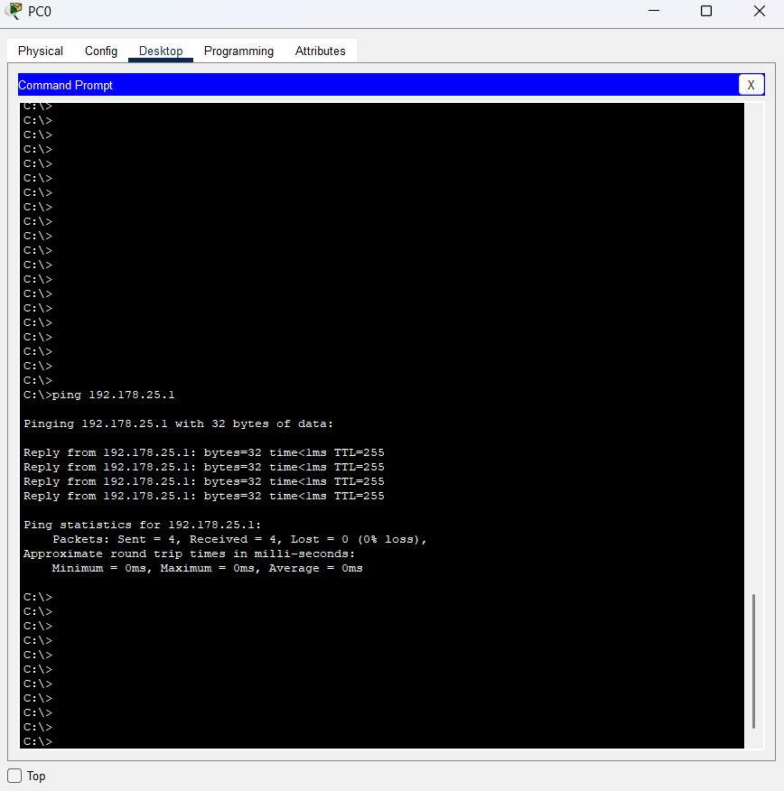

**Resultado:**  Reply - Packets: Sent=4, Received=4, Lost=0 (0% loss)

### 4.2 Comunicación misma VLAN ambos lados (Básicos derecho)
```
ping 192.178.75.2
```
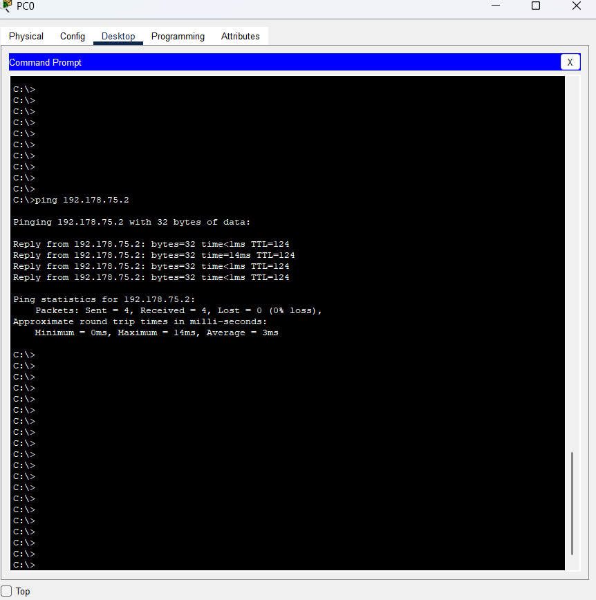

**Resultado:**  Reply - Packets: Sent=4, Received=4, Lost=0 (0% loss)

### 4.3 Comunicación Inter-VLAN (Básicos a Primaria izquierdo)
```
ping 192.178.15.2
```
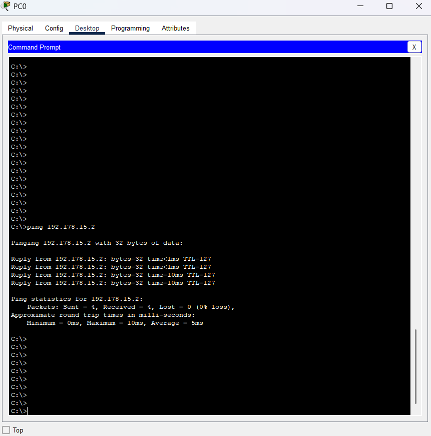

**Resultado:**  Reply - Packets: Sent=4, Received=4, Lost=0 (0% loss)

### 4.4 Comunicación misma VLAN mismo lado (Bachillerato izquierdo)
```
ping 192.178.35.2
```
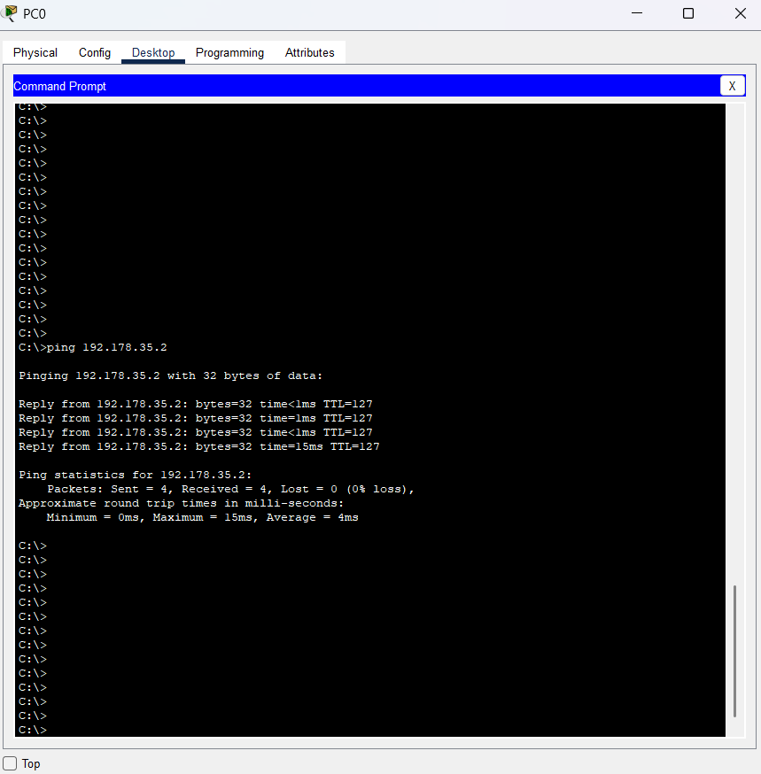

**Resultado:**  Reply - Packets: Sent=4, Received=4, Lost=0 (0% loss)

### 4.5 Comunicación misma VLAN ambos lados (Bachillerato derecho)
```
ping 192.178.85.2
```


**Resultado:**  Reply - Packets: Sent=4, Received=4, Lost=0 (0% loss)

### 4.6 Comunicación Inter-VLAN (Básicos a Bachillerato)
```
ping 192.178.35.2
```
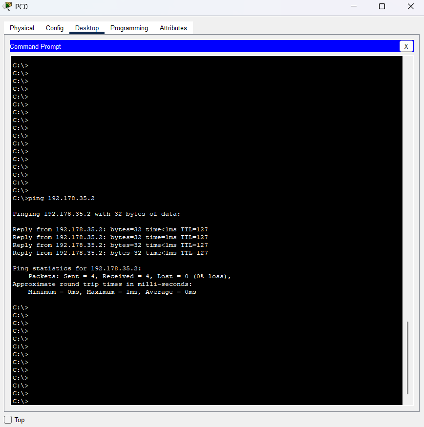

**Resultado:**  Reply - Packets: Sent=4, Received=4, Lost=0 (0% loss)

### 4.7 Comunicación misma VLAN mismo lado (Primaria izquierdo)
```
ping 192.178.15.3
```
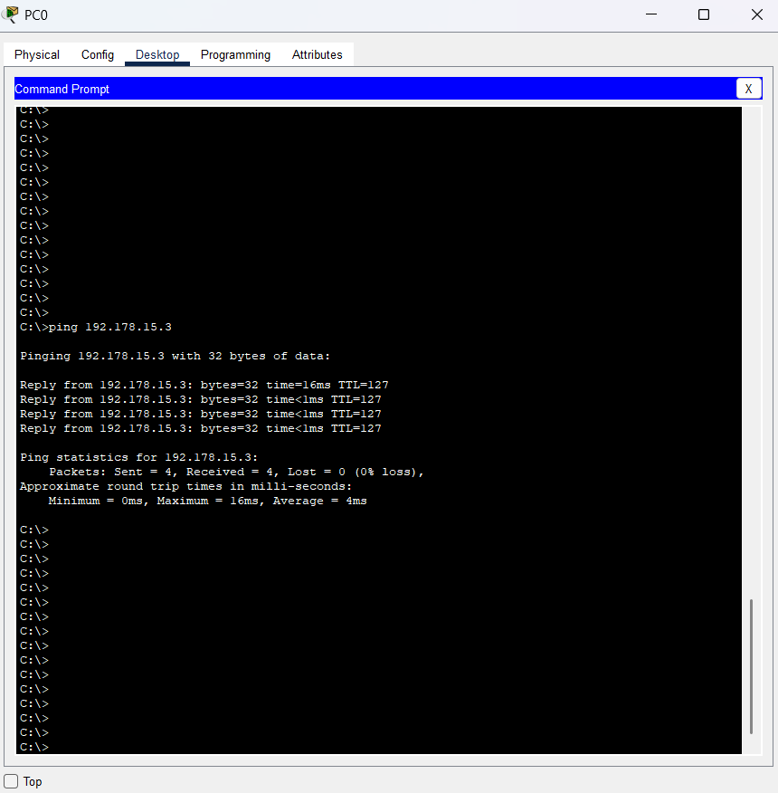

**Resultado:**  Reply - Packets: Sent=4, Received=4, Lost=0 (0% loss)

### 4.8 Comunicación misma VLAN ambos lados (Primaria derecho)
```
ping 192.178.65.2
```
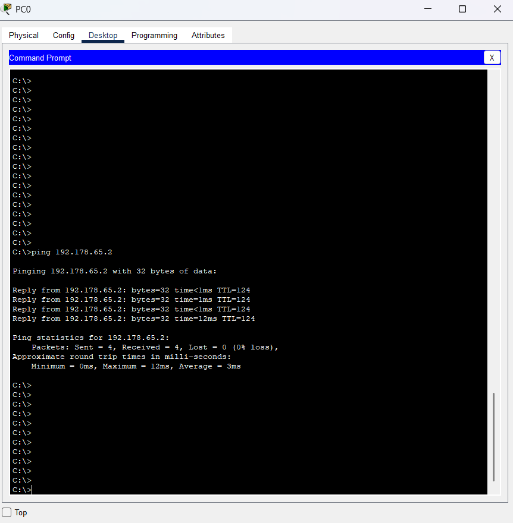

**Resultado:**  Reply - Packets: Sent=4, Received=4, Lost=0 (0% loss)

### 4.9 Comunicación Inter-VLAN (Básicos a Primaria derecho)
```
ping 192.178.75.3
```


**Resultado:**  Reply - Packets: Sent=4, Received=4, Lost=0 (0% loss)

### Resumen de pruebas

| Prueba | Descripción | Resultado |
|---|---|---|
| 4.1 | Básicos mismo lado |  Exitoso |
| 4.2 | Básicos ambos lados |  Exitoso |
| 4.3 | Inter-VLAN Básicos-Primaria |  Exitoso |
| 4.4 | Bachillerato mismo lado |  Exitoso |
| 4.5 | Bachillerato ambos lados |  Exitoso |
| 4.6 | Inter-VLAN Básicos-Bachillerato |  Exitoso |
| 4.7 | Primaria mismo lado |  Exitoso |
| 4.8 | Primaria ambos lados |  Exitoso |
| 4.9 | Inter-VLAN Básicos-Primaria derecho |  Exitoso |

---

## 12. Conclusiones

1. **VLANs**: Se configuraron exitosamente 6 VLANs (3 por edificio) utilizando VTP para propagación automática, lo que simplifica la administración de la red.

2. **Enrutamiento dinámico**: Se implementaron 3 protocolos de enrutamiento (EIGRP, RIP v2 y OSPF) en los routers correspondientes, logrando comunicación completa entre todos los dispositivos de ambos edificios.

3. **Inter-VLAN routing**: Se configuró correctamente el router-on-a-stick en Router0 y Router3 usando subinterfaces dot1Q, permitiendo la comunicación entre todas las VLANs.

4. **Spanning Tree**: Se implementó PVST en el edificio izquierdo y Rapid PVST en el derecho. Se recomienda migrar toda la red a Rapid PVST por su menor tiempo de convergencia.

5. **Seguridad**: Se implementó port-security en los puertos de la VLAN Básicos con modo shutdown para prevenir accesos no autorizados.

6. **Comunicación total**: Todos los 9 escenarios de ping fueron exitosos, verificando conectividad intra-VLAN e inter-VLAN entre ambos edificios.

---

