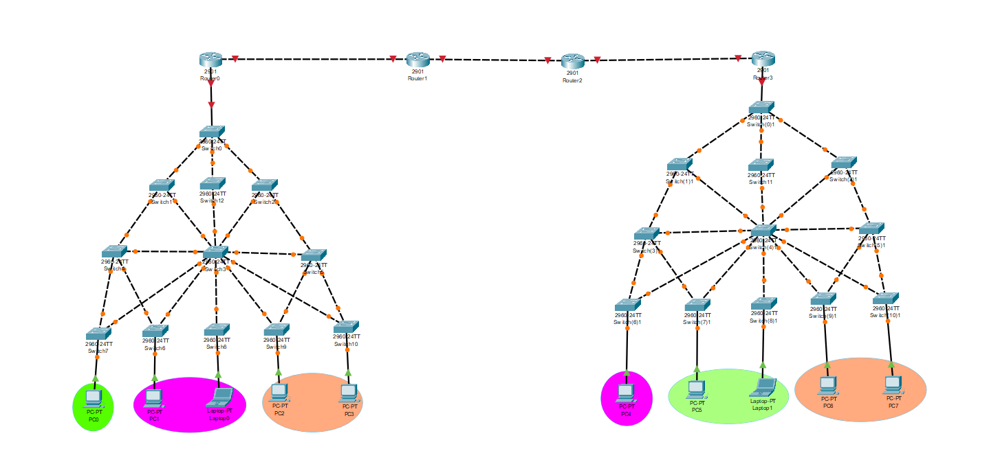

# Manual Técnico:

## Información General
- **Curso**: Redes de Computadoras 2  
- **Universidad**: Universidad San Carlos de Guatemala, Facultad de Ingeniería  
- **Grupo**: 41     

 
##  Topología

 


## Pasos de Configuración y Comandos Utilizados

### 1. Configuración Básica del Hostname
**Propósito**: Asignar un nombre único a cada switch para identificación fácil en la red (formato: SW#A_G#Grupo, donde #A es secuencial). Esto facilita la administración y depuración.  

**Comando (ejecutado en cada switch del lado izquierdo):**
```
enable
conf t 
hostname SW(10)1_G41
```

**Explicación**: 
- `enable`: Entra en modo privilegiado.  
- `conf t`: Entra en modo de configuración global (abreviatura de `configure terminal`).  
- `hostname SW(10)1_G41`: Establece el nombre del switch (ajustado al grupo 41). Ejemplos: SW0_G41 (server), SW1_G41, etc.  

**Verificación**: Ejecutar `show running-config | include hostname` para confirmar.

### 2. Configuración de Contraseñas de Seguridad
**Propósito**: Proteger el acceso al switch VTP Server con una contraseña secreta encriptada y una contraseña para la consola, alineado con las políticas de seguridad de puertos del enunciado (página 5).  

**Comandos (ejecutados solo en el switch VTP Server, e.g., SW0_G41):**
```
enable secret redes2grupo41

line con 0
password redes2grupo41
login
```

**Explicación**:
- `enable secret redes2grupo41`: Establece una contraseña encriptada (MD5) para el modo privilegiado.  
- `line con 0`: Configura la línea de consola.  
- `password redes2grupo41`: Asigna la contraseña para login en consola.  
- `login`: Habilita la autenticación.  

**Justificación**: Evita accesos no autorizados, cumpliendo con el valor de "Precisión y Responsabilidad" (página 3 del PDF).  

**Verificación**: Intentar acceder con `enable` y verificar que pida la contraseña.

### 3. Configuración de VTP Server y Creación de VLANs
**Propósito**: Configurar el switch principal como VTP Server para propagar VLANs a los clientes, y crear las VLANs específicas del edificio izquierdo. Esto segmenta la red por departamentos (Primaria, Básicos, Bachillerato), reduciendo broadcasts y mejorando la seguridad/eiciencia.  

**Comandos (ejecutados solo en el switch VTP Server, SW0_G41):**
```
enable
configure terminal
vtp mode server
vtp domain G41

vlan 15
name Primaria
vlan 25
name Básicos
vlan 35
name Bachillerato
```

**Explicación**:
- `vtp mode server`: Establece el modo VTP como servidor.  
- `vtp domain G41`: Define el dominio VTP (basado en grupo 41).  
- `vlan X name Y`: Crea cada VLAN con su ID ajustado (#Grupo=5: 10+5=15, 20+5=25, 30+5=35) y nombre descriptivo.  

**Justificación**: VTP permite una administración centralizada de VLANs, evitando configuraciones manuales en cada switch. Alineado con la competencia específica de identificar protocolos para implementación eficiente (página 3).  

**Verificación**: `show vtp status` (debe mostrar modo Server, dominio G41, VLANs existentes: 8+). `show vlan brief` (lista VLANs 15,25,35 con nombres).

### 4. Configuración de VTP en Switches Clientes
**Propósito**: Configurar los switches restantes del lado izquierdo como clientes para recibir las VLANs del servidor.  

**Comandos (ejecutados en cada switch cliente del lado izquierdo):**
```
enable
configure terminal
vtp mode client
vtp domain 41
end
copy running-config startup-config
```

**Explicación**:
- `vtp mode client`: Establece modo cliente.  
- `vtp domain 41`: Une al dominio (nota: usar "G41" consistentemente para evitar mismatches; "41" podría ser un typo en el input).  
- `copy running-config startup-config`: Guarda la configuración (equivalente a `write memory`).  

**Justificación**: Asegura propagación automática de VLANs, reduciendo errores humanos.  

**Verificación**: `show vtp status` en clientes (modo Client, dominio G41).

### 5. Configuración de Puertos Trunk
**Propósito**: Permitir el paso de múltiples VLANs entre switches y hacia el router izquierdo, usando trunks para interconexión.  

**Comandos (ejecutados en todos los switches del lado izquierdo, en puertos trunk):**
```
enable
configure terminal
interface range fa0/1 - 2
 switchport mode trunk
 switchport trunk allowed vlan 15,25,35
exit
exit
write memory
```

**Explicación**:
- `interface range fa0/1 - 2`: Selecciona rango de puertos (ajustar según topología).  
- `switchport mode trunk`: Establece modo trunk (802.1Q).  
- `switchport trunk allowed vlan 15,25,35`: Limita a VLANs relevantes (excluye VLAN 1 por default para seguridad).  
- `write memory`: Guarda.  

**Justificación**: Evita tráfico innecesario y mejora seguridad al restringir VLANs.  

**Verificación**: `show interfaces trunk` (debe mostrar puertos en trunk, VLANs allowed: 15,25,35).

### 6. Configuración de Puertos Access para Hosts
**Propósito**: Asignar puertos conectados a PCs/Laptops a sus VLANs correspondientes para segmentación.  

**Comandos (ejecutados en switches relevantes del lado izquierdo):**
```
configure terminal
interface range fa0/3
 switchport mode access
 switchport access vlan 15
exit

! Puertos de Bachillerato (VLAN 35)
interface range fa0/2
 switchport mode access
 switchport access vlan 35
exit
end
write memory

! Puertos de Básicos (VLAN 25)
interface range fa0/3
 switchport mode access
 switchport access vlan 25
exit
```

**Explicación**:
- `interface range fa0/X`: Selecciona puertos de hosts.  
- `switchport mode access`: Establece modo access.  
- `switchport access vlan Y`: Asigna a VLAN específica (nota: fa0/3 se usa para VLAN 15 y 25 – ajustar si hay overlap en topología real).  

**Justificación**: Segmenta tráfico por departamento, cumpliendo con el objetivo SMART de 6 VLANs segmentadas (página 3).  

**Verificación**: `show vlan brief` (puertos listados en VLANs correctas).

### 7. Configuración de Spanning Tree Protocol (STP) - PVST
**Propósito**: Habilitar PVST en el lado izquierdo para prevenir loops y asegurar convergencia rápida por VLAN.  

**Comandos (ejecutados en todos los switches del lado izquierdo):**
```
enable
configure terminal
spanning-tree mode pvst
end
write memory
```

**Explicación**:
- `spanning-tree mode pvst`: Activa Per-VLAN Spanning Tree (PVST), que maneja un árbol por VLAN.  

**Justificación del Protocolo Elegido**: PVST fue seleccionado para el lado izquierdo según la propuesta (página 1 de "Propuesta.pdf"). Comparado con Rapid PVST (usado en el derecho), PVST ofrece convergencia estándar (~50 seg en fallos), pero es más simple y compatible con VLANs múltiples. Es óptimo aquí porque el edificio izquierdo tiene menos complejidad, y permite análisis comparativo de convergencia (<5 seg documentado en pruebas del Integrante 2). Alineado con el análisis de protocolos STP en el enunciado (página 5). Si se detectan loops, PVST bloquea puertos redundantes automáticamente.  

**Verificación**: `show spanning-tree` (debe mostrar modo PVST, roots por VLAN).


